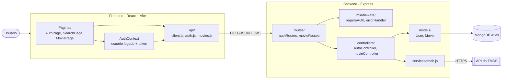
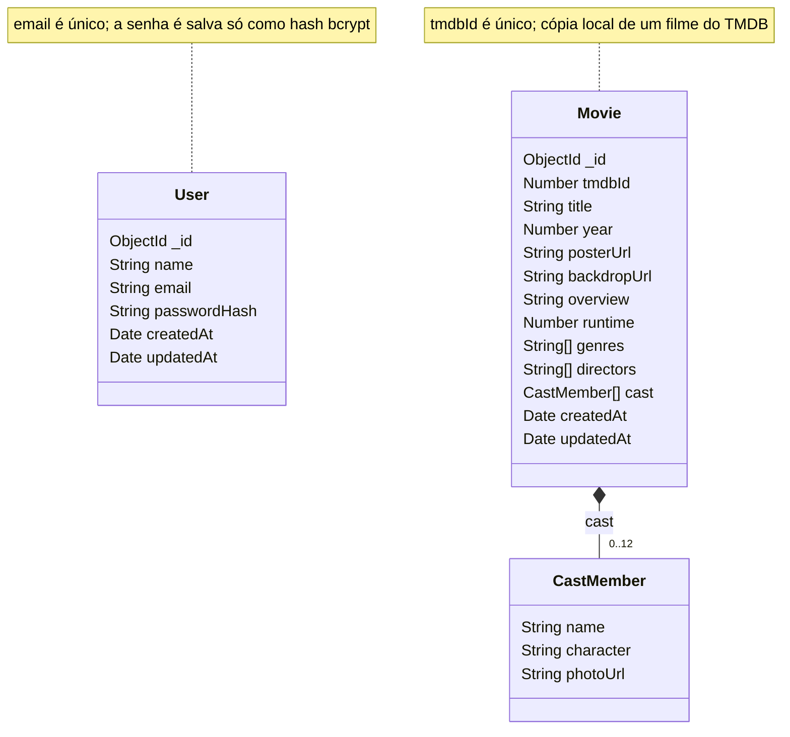

# CineList

Aplicativo web para registrar, avaliar e compartilhar filmes assistidos. O usuário mantém um diário
do que assistiu, atribui notas, escreve resenhas, organiza listas e acompanha as avaliações de
outras pessoas.

## Membros

- Gabriel Cancado de Castro - Fullstack - Matrícula 2020035019
- Gabriel Martins Assunção dos Santos - Fullstack - Matrícula 2023111131
- Messias da Silva Sabadini - Fullstack - Matrícula 2021032188

## Tecnologias

- Express.js para construção do servidor
- MongoDB para o banco de dados
- React para a construção do front-end
- Claude code e Gemini como ferramentas de IA

## Histórias de Usuário

1. **Cadastro e login** — Como visitante, quero criar uma conta e fazer login com e-mail e senha,
   para ter um perfil próprio onde meus filmes e avaliações ficam salvos.

2. **Busca de filmes** — Como usuário, quero buscar filmes por título, diretor ou ano,
   para encontrar rapidamente o filme que quero avaliar ou consultar.

3. **Página do filme** — Como usuário, quero ver a ficha de um filme com sinopse, elenco, duração e
   nota média da comunidade, para decidir se vale a pena assistir.

4. **Avaliação com nota** — Como usuário, quero dar uma nota de 0 a 5 estrelas a um filme que assisti,
   para registrar minha opinião e ajudar a formar a nota média da comunidade.

5. **Resenhas** — Como usuário, quero escrever uma resenha em texto sobre um filme,
   para detalhar minha opinião e compartilhá-la com outras pessoas.

6. **Diário de filmes assistidos** — Como usuário, quero marcar um filme como assistido informando a data,
   para manter um histórico cronológico de tudo o que já vi.

7. **Lista de "quero assistir"** — Como usuário, quero adicionar filmes a uma lista de desejos,
   para não esquecer os títulos que pretendo assistir depois.

8. **Seguir usuários e feed** — Como usuário, quero seguir outros perfis e ver suas avaliações recentes
   em um feed, para descobrir novos filmes a partir de pessoas com gosto parecido com o meu.

## Arquitetura

O sistema é dividido em um frontend web (React) e um backend (API REST em Express com MongoDB).
Os dados dos filmes vêm da API pública do [TMDB](https://www.themoviedb.org/); o backend faz a
ponte com o TMDB (a chave fica só no servidor) e guarda no MongoDB uma cópia de cada filme aberto,
para que avaliações, diário e listas referenciem documentos locais.

### Diagrama de componentes

### Diagrama de classes (modelos do banco)

